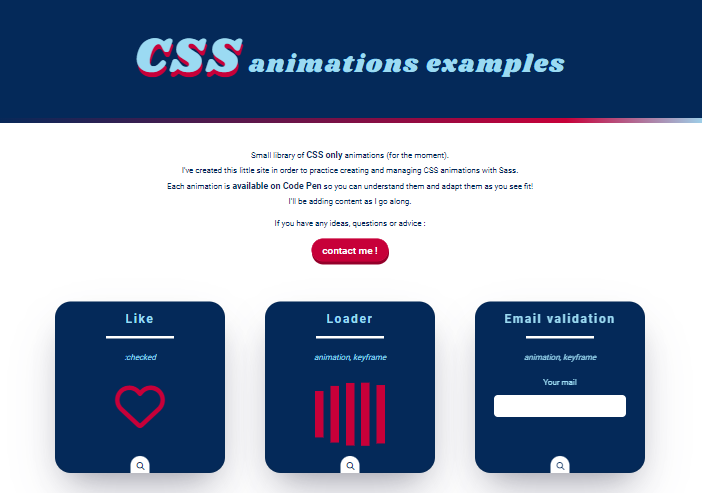

# Animation library

Grouping of various animations using transitions and keyframes. 

### 📚 Context

At one time or another, we've all wasted time trying to figure out when we coded this or that, or where we "stored" it... 😫  
To avoid searching through numerous projects, I've created a library of animations, in CSS only, where I store those that seem important and easily reusable.  
I'm sharing this little project with you, because it's also thanks to the sharing of others that I've been able to enrich my knowledge and manipulate animations 😃.  

### Technologies

HTML5/CSS3  
Sass
